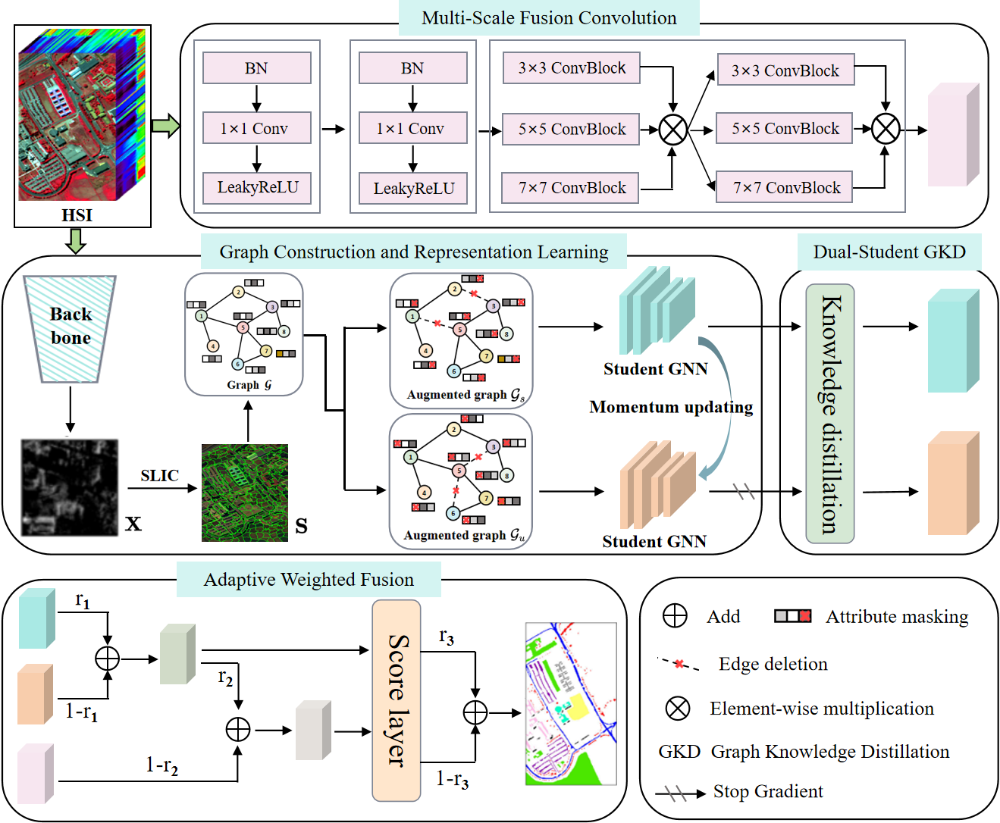
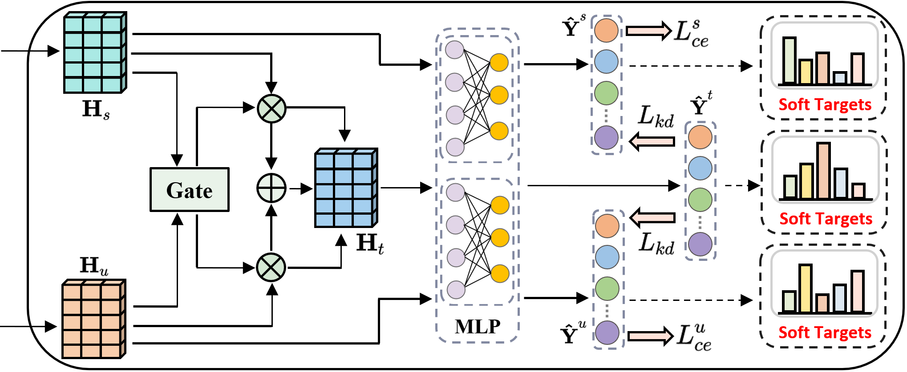
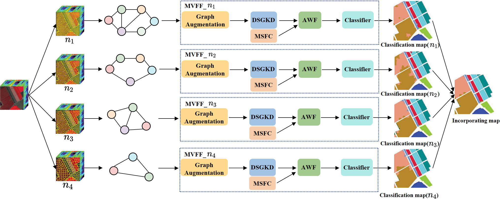

#  Dual-Graph Knowledge Distillation Meets Multi-Scale CNN: A Novel Ensemble Approach for Few-shot Hyperspectral Image Classification

[Xiaolong Li](), [Huifang Ma](https://scholar.google.com/citations?user=r4iH7uIAAAAJ&hl=zh-CN&oi=sra), [Shuheng Guo](), [Di Zhang](), [Zhixin Li](https://scholar.google.com/citations?user=YSxg4CMAAAAJ&hl=zh-CN)


<hr />

> **Abstract:** HyperSpectral Image (HSI) classification aims at categorizing each pixel in an HSI, facilitating precise identification and differentiation of various land cover types. In recent years, Graph Neural Networks (GNNs)-based methods for HSI classification have exhibited impressive performance when abundant labeled samples are available. However, their effectiveness is notably constrained in real-world scenarios with limited labeled samples. Furthermore, current approaches predominantly concentrate on extracting global features at the superpixel level, overlooking the efficient exploration of pixel-level local features, leading to incomplete feature representations. To tackle these challenges, we propose a novel ensemble approach named Dual-Graph Knowledge Distillation Meets Multi-Scale CNN (KDMSC) for few-shot hyperspectral image classification. Specifically, at the superpixel level, a graph structure is initially constructed for segmented superpixels, enhancing two distinct graph views. To amalgamate the dual-graph model, a dual-student graph knowledge distillation module is introduced. This module intelligently merges the dual graph structures based on superpixels, creating an ensemble teacher model that utilizes superpixel predictions as supplementary supervisory signals, thereby bolstering the model's feature learning capabilities. At the pixel level, a multi-scale Convolutional Neural Network (CNN) module is integrated to capture local spatial and spectral information across various receptive fields. This effectively explores pixel-level local features and enriches the pixel-level feature representation. Finally, an adaptive weighted fusion strategy is proposed, dynamically adjusting the contribution of global and local features. This enables the effective fusion of superpixel-level and pixel-level features, significantly enhancing the completeness and discriminability of the feature representations. Moreover, ensemble learning is introduced to further enhance the method's robustness. Experimental results on four benchmark datasets, each with only five labeled samples per class, demonstrate that the proposed method surpasses existing deep learning techniques in terms of classification accuracy and generalization performance. 
<hr />


## KDMSC-Network Architecture-
<!--  -->
<div aligh=center witdh="100"></div>

## Dual Student Graph Knowledge Distillation Module
<!--  -->
<div aligh=center witdh="70"></div>

## Ensemble Learning Architecture
<!--  -->
<div aligh=center witdh="70"></div>

## 1. Create Envirement:

- Python 3 (Recommend to use [Anaconda](https://www.anaconda.com/download/#linux))

- NVIDIA GPU + [CUDA](https://developer.nvidia.com/cuda-downloads)


## 2. Data Preparation:
- Download the data including raw `.mat` files from <a href="https://www.ehu.eus/ccwintco/index.php/Hyperspectral_Remote_Sensing_Scenes">here</a>  and place them in `data/`.

- Before trainig, every data set is split by runing `trainTestSplit.py`, shown as follow:

  ```shell
  python trainTestSplit.py --name PaviaU (data set name)
  ```

## 3. Training

To train a model, run

```shell
# Training on PaviaU data set
python train.py --name PaviaU --block 100 --gpu 0 
```
Here, `--block` denots the number of superpixel, which lies in `[100, 150, 300, 350]` in our ensemble setup.

The model with best accuracy will be saved.


## 4. Prediction:

To test a trained model, run 

```shell
# Testing on PaviaU data set
python predict.py --name PaviaU --block 100 --gpu 0
```


## 5. Ensemble learning:

After training and prediction at four scales, ensemble learning is performed.

```shell
# Perform ensemble learning on the PaviaU dataset.
python Maxvoting.py
```

The code will load the best model in the last phase automatically.

